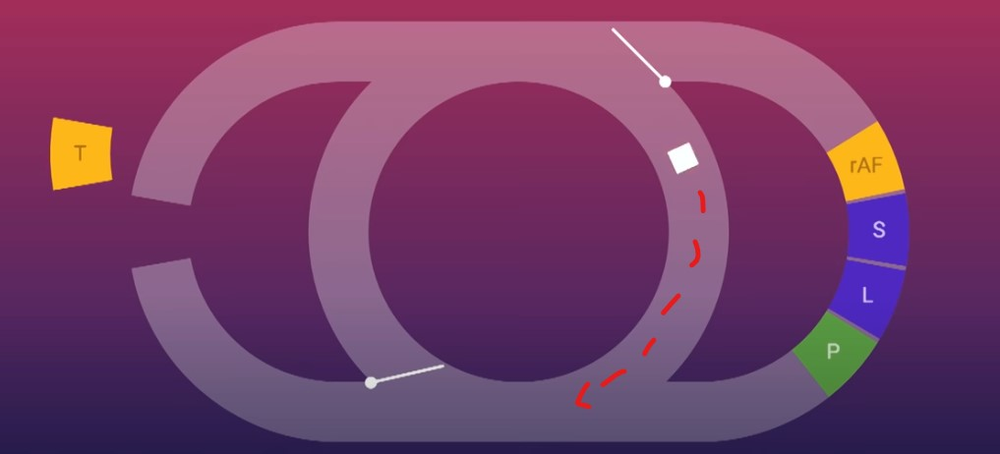

# JavaScript Notes

Some notes on JavaScript, the language of the web! 

\*From now on I will shorten JavaScript to **js**

## General Info

* Stored in a .js file extension

* Is single threaded

* Runs in a single event loop

  pseudocode:

  ```lua
  while window.isOpen do
      if decideWindowUpdate() do
      	drawScreen()
      if decideEventUpdate() do
      	eventLoop()
  ```

  

  from https://www.youtube.com/watch?v=cCOL7MC4Pl0&ab_channel=JSConf

  The event loop shown above shows how this single threaded language runs. It runs much like a game engine like pygame or love. 

1. While the windows is open and running
2. Decide whether is should update the window 
3. Updates screen only if it decides so
4. Then decide if event loop should be execute
5. If so, execute event loop
   * therefore if there is a `while (true)` loop, it will get stuck because the eventLoop() does not end

See this [YouTube](https://www.youtube.com/watch?v=cCOL7MC4Pl0&ab_channel=JSConf) video for a very indepth explanation

## Language

* arrays can contain multiple types with python
* objects are like dictionaries in python, ie. they are a hash table/map that maps from a string to an object 
* arrow functions are shorthand functions that very similar to regular functions with a few minor changes
* async/await - once an async function encounters a await, it will be added to the event loop and continue executing 

## Uses

js runs on the browser but can also run outside the browser with node.js. Node.js has a package manager called the node package manager or **npm** for short. With npm, there are a ton of packages that are quite powerful and different. For example, Electron.js is a desktop app creation tool that utilizes chromium at its core.

### Popular Packages

Some of the most popular packages include:

* React - front end library that was developed by Facebook
* React Native - Based on react but works on Android and iOS, it is very fast as it transcodes into its native language, ie Java for Android and Swift for iOS
* Express - a backend framework 
* Electron - a desktop app creation tool (not very space efficient)
* Socket.IO - library for developing with sockets (things that need to updated in real time)
* \+ much much more...

## TypeScript

* TypeScript is a superset of js that adds static typing options
* It was designed to make js more strict. 
* TypeScript ultimately translates into js

## Licence

MIT
